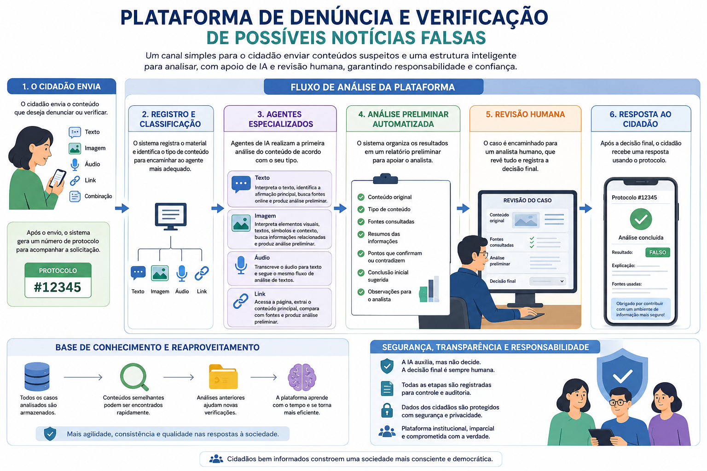

# VerificaAI

Protótipo em Python para triagem e apuração assistida de possíveis fake news. O projeto nasceu para apoiar o combate à desinformação no período eleitoral e deve evoluir depois para cenários mais amplos de verificação de fatos.

O repositório está em nome do `Ministério Público do Estado do Acre` e segue uma proposta de inovação aberta: desenvolvimento institucional com colaboração da comunidade.



## Estado atual

O que existe hoje:

- execução local via terminal;
- workflow em `LangGraph`;
- roteamento entre agentes por tipo de entrada;
- agente de busca com ferramentas de data atual, descoberta de links e leitura de páginas;
- análise de imagens por modelo multimodal antes da pesquisa online;
- transcrição de áudio por API externa;
- suporte a múltiplos anexos e a links encontrados na consulta;
- síntese final estruturada da resposta;
- persistência opcional das respostas finais no Qdrant;
- geração de embeddings dense, sparse e ColBERT para busca híbrida;
- prompts separados em arquivos `.md`.

O que ainda não existe ou está incompleto:

- interface web;
- API `FastAPI`;
- persistência de casos, protocolos e revisão humana;

## Como o protótipo funciona

O fluxo atual é:

1. o usuário digita uma consulta no terminal;
2. o router classifica a entrada;
3. o workflow decide quais agentes executar;
4. imagens, áudios e vídeos são processados em paralelo e convertidos em contexto textual;
5. o agente de busca usa ferramentas externas para apuração;
6. o router sintetiza a resposta final;
7. se o Qdrant estiver habilitado, a persistência da pergunta e da resposta final
   é enviada para uma fila dedicada;
8. o worker do Qdrant gera os embeddings e armazena um único point na collection.

O point salvo no Qdrant usa o ID do job RQ como identificador e contém:

- os vetores nomeados `dense`, `sparse` e `colbert`;
- o payload `text`, `meta`, `query`, `answer` e `sources`.

O uso do ID do job evita a criação de pontos duplicados caso uma mesma execução
seja repetida.

Hoje os agentes disponíveis são:

- `search_agent`: faz busca e leitura de fontes;
- `image_agent`: interpreta uma imagem pública e encaminha suas alegações ao agente de busca;
- `transcription_agent`: envia URLs públicas de áudio ou vídeo para transcrição e encaminha os textos ao agente de busca.

## Requisitos

- Python `3.13`
- `uv` para instalar dependências e executar o projeto
- acesso aos modelos configurados para o router, a busca e a análise multimodal
- chave da SerpAPI
- serviço HTTP para converter URL em markdown, configurado nas variáveis `FETCH_SITE_*`
- acesso à API de transcrição, configurado nas variáveis `TRANSCRIPTION_*`
- acesso a uma instância Qdrant, opcional, para persistência vetorial das respostas finais

## Configuração

1. Instale as dependências:

```bash
uv sync
```

2. Crie o arquivo `.env` a partir do `.env.example`:

```bash
cp .env.example .env
```

3. Preencha as variáveis necessárias.

Principais grupos de configuração:

- `ROUTER_*`: configuração da LLM do router.
- `SEARCH_*`: configuração da LLM do agente de busca.
- `IMAGE_*`: configuração opcional da LLM multimodal; sem `IMAGE_MODEL`, reutiliza `SEARCH_*`.
- `ATTACHMENTS_MAX_ITEMS`: quantidade máxima de conteúdos aceitos em uma análise.
- `ANALYZE_REQUESTS_DB_PATH`: banco SQLite dos registros de solicitações aceitas.
- `SERPAPI_API_KEY`: busca de links.
- `FETCH_SITE_*`: leitura e conversão de páginas web.
- `TRANSCRIPTION_*`: envio do áudio, consulta de status, polling e timeout.
- `FINAL_RESULTS_*`: fila e API de destino das respostas finais.
- `QDRANT_*`: conexão, collection e modelos usados na persistência vetorial opcional.
- `LANGSMITH_*`: tracing opcional dos workflows executados pelos workers.
- `*_PROMPT`: caminhos dos prompts usados pelo workflow.

Para `ROUTER_*`, `SEARCH_*` e `IMAGE_*`, o contrato é sempre o mesmo:

- `*_PROVIDER`: `google`, `openai` ou `vllm`
- `*_MODEL`: nome do modelo
- `*_API_KEY`: credencial do provider
- `*_BASE_URL`: endpoint do provider quando ele for OpenAI-compatible

`router`, `search` e `image` podem usar providers diferentes. O modelo configurado
em `IMAGE_MODEL` precisa aceitar imagens como entrada.

### LangSmith

O tracing dos workflows é opcional e permanece desabilitado por padrão. Para
ativá-lo, configure uma chave e habilite o envio:

```env
LANGSMITH_TRACING=true
LANGSMITH_API_KEY=sua_chave_langsmith
LANGSMITH_PROJECT=verificaai-development
LANGSMITH_HIDE_INPUTS=true
LANGSMITH_HIDE_OUTPUTS=true
```

Cada execução de análise é registrada como `analyze_workflow`, com o `task_id` e
a versão da aplicação em metadata. Isso permite correlacionar a solicitação
aceita com a execução do worker. Mantenha `LANGSMITH_HIDE_INPUTS` e
`LANGSMITH_HIDE_OUTPUTS` habilitados para não enviar consultas, anexos,
transcrições, prompts, respostas ou retornos de ferramentas ao LangSmith.

Regra prática:

- `google`: use `*_PROVIDER`, `*_MODEL` e `*_API_KEY`; deixe `*_BASE_URL`
  vazio
- `openai` e `vllm`: use os quatro campos

Exemplos:

```env
ROUTER_PROVIDER=google
ROUTER_MODEL=gemini-2.5-flash
ROUTER_API_KEY=sua_chave_google
ROUTER_BASE_URL=
```

```env
SEARCH_PROVIDER=vllm
SEARCH_MODEL=Qwen/Qwen3-14B-FP8
SEARCH_API_KEY=sua_chave_vllm
SEARCH_BASE_URL=https://seu-endpoint/v1
```

```env
IMAGE_PROVIDER=google
IMAGE_MODEL=gemini-2.5-flash
IMAGE_API_KEY=sua_chave_google
IMAGE_BASE_URL=
```

### Conteúdos recebidos

O endpoint `/analyze` aceita texto, anexos ou ambos. Imagens, áudios e vídeos
enviados por uma integração devem ser informados em `attachments`:

```json
{
  "query": "Verifique os conteúdos enviados",
  "attachments": [
    {
      "type": "image",
      "url": "https://example.com/imagem.jpg",
      "mime_type": "image/jpeg"
    },
    {
      "type": "audio",
      "url": "https://example.com/audio.ogg",
      "mime_type": "audio/ogg"
    }
  ]
}
```

Quando a solicitação tiver sido originada por uma pessoa em uma aplicação
externa, seus identificadores podem ser informados em `requester`:

```json
{
  "query": "Essa informação é verdadeira?",
  "requester": {
    "external_id": "+5568999999999",
    "conversation_id": "conversation-id",
    "message_id": "message-id"
  }
}
```

A aplicação de origem não é aceita no payload. Ela é identificada pelo bearer
token e acrescentada pelo VerificaAI antes da entrega ao painel. A criação do
token exige um `name` e gera um `application_id` UUID estável e não secreto.
O `requester` não é enviado aos modelos nem persistido no Qdrant.

Na entrega do resultado ao painel, o objeto é enriquecido desta forma:

```json
{
  "requester": {
    "application": {
      "id": "c824bf11-2a72-43dd-919b-a3f76de5fe04",
      "name": "Agente WhatsApp"
    },
    "external_id": "+5568999999999",
    "conversation_id": "conversation-id",
    "message_id": "message-id"
  }
}
```

Todos os links HTTP ou HTTPS presentes na `query` também são adicionados
automaticamente aos anexos. Anexos explícitos e links da consulta são
deduplicados, mas a `query` original permanece inalterada. O tipo é identificado
primeiro pelo MIME type informado e depois pela extensão da URL.

Áudios e vídeos destinados à transcrição aceitam somente os formatos `.mpeg`,
`.ogg`, `.mp3`, `.wav`, `.mp4`, `.avi` e `.webm`. Quando a URL não possui
extensão, é obrigatório informar um MIME type equivalente a um desses formatos.
Um formato inválido recebe resposta HTTP `422` antes da criação do job e não é
enviado aos agentes ou modelos.

Quando há várias mídias, os agentes especializados processam cada uma e o agente
de busca recebe uma única consulta com todos os contextos extraídos.

### Solicitações aceitas

Depois que uma chamada autenticada e validada é enfileirada, o VerificaAI
registra seu `task_id`, a aplicação autenticada e o horário de aceitação no banco
definido por `ANALYZE_REQUESTS_DB_PATH`. O payload da solicitação não é
persistido nesse registro. Uma falha nessa gravação é registrada no log, mas não
altera a resposta `202` nem impede o processamento da análise.

Os registros podem ser consultados com autenticação administrativa:

```text
GET /admin/analyze-requests?application_id={uuid}&limit=50&offset=0
```

A resposta inclui `total`, `limit`, `offset` e os itens da página. A rota aparece
na documentação somente quando `ADMIN_DOCS_ENABLED=true`.

### Reanálise

O endpoint autenticado `POST /reanalyze` permite solicitar uma ampliação de um
resultado automático ainda não revisado por uma pessoa:

```json
{
  "reanalysis_id": "66c97611-3931-4f96-b963-17f5121b2353",
  "final_result_id": "c824bf11-2a72-43dd-919b-a3f76de5fe04",
  "prompt": "Verifique também se o fato representado na imagem aconteceu."
}
```

Antes de enfileirar o job, o VerificaAI consulta o resultado original em
`FINAL_RESULTS_API_URL/{final_result_id}`. Resultados que já tenham classificação
humana recebem HTTP `409` e não são enviados aos agentes.

A reanálise utiliza a consulta, a resposta, a classificação, as fontes e os
anexos do `FinalResult` automático. As mídias originais são processadas novamente
antes da pesquisa online. A síntese devolvida é uma nova resposta completa: ela
preserva o conteúdo anterior que continua relevante e incorpora as evidências da
nova consulta. Conteúdo anterior somente deve ser removido quando a instrução
humana solicitar ou quando novas evidências exigirem uma correção.

O enqueue responde com HTTP `202`:

```json
{
  "task_id": "uuid-do-job",
  "status": "queued"
}
```

O andamento pode ser consultado, com autenticação, em
`GET /reanalyze/status/{task_id}`. Ao terminar, o resultado é enviado para
`REANALYSIS_RESULTS_API_URL/{reanalysis_id}/result` pela mesma fila e pelo mesmo
worker usados nas entregas ao VerificaAI Painel. Entregas repetidas devem ser
tratadas de forma idempotente pelo painel.

### Qdrant

A integração com o Qdrant é opcional. Use `QDRANT_ENABLED=false` para concluir as
análises sem enfileirar a persistência vetorial. Quando habilitada, a resposta final
é enviada para a fila `qdrant`, sem bloquear a conclusão do job principal. Um
worker dedicado verifica ou cria a collection, gera os embeddings e persiste o
point. Falhas nessa etapa seguem a política de retry da fila e não alteram o status
público da análise.

Exemplo de configuração:

```env
QDRANT_ENABLED=true
QDRANT_QUEUE_NAME="qdrant"
QDRANT_JOB_TIMEOUT_SECONDS=900
QDRANT_RESULT_TTL_SECONDS=86400
QDRANT_FAILURE_TTL_SECONDS=604800
QDRANT_RETRY_INTERVALS_SECONDS="60,300,900"
QDRANT_DENSE_MODEL="intfloat/multilingual-e5-large"
QDRANT_SPARSE_MODEL="Qdrant/bm25"
QDRANT_COLBERT_MODEL="colbert-ir/colbertv2.0"
QDRANT_MAX_TOKENS=1024
QDRANT_COLLECTION_NAME="verifica-ai"
QDRANT_API_URL="https://seu-qdrant"
QDRANT_API_KEY="sua-chave"
QDRANT_API_PORT=443
QDRANT_TIMEOUT_SECONDS=60
```

Cada resposta final é persistida como um único point. A pergunta e a resposta
são usadas para gerar os embeddings dense, sparse e ColBERT, enquanto as fontes
e os demais dados permanecem disponíveis no payload. `QDRANT_TIMEOUT_SECONDS`
limita cada operação de rede do cliente, enquanto `QDRANT_JOB_TIMEOUT_SECONDS`
limita o job completo, incluindo carregamento dos modelos e geração dos embeddings.

O serviço `verificaai-qdrant-worker` usa a mesma imagem da API e deve ser executado
somente nos deployments em que `QDRANT_ENABLED=true`.

### Entrega dos resultados finais

Ao concluir uma análise, o worker principal enfileira a entrega da resposta para
a API configurada em `FINAL_RESULTS_API_URL`. A fila `final-results` é consumida
por um worker dedicado e repete requisições que falharem conforme os intervalos
definidos em `FINAL_RESULTS_RETRY_INTERVALS_SECONDS`.

```env
FINAL_RESULTS_QUEUE_NAME="final-results"
FINAL_RESULTS_JOB_TIMEOUT_SECONDS=60
FINAL_RESULTS_RESULT_TTL_SECONDS=86400
FINAL_RESULTS_FAILURE_TTL_SECONDS=604800
FINAL_RESULTS_RETRY_INTERVALS_SECONDS="10,30,60,300,900"
FINAL_RESULTS_API_URL="http://laravel:8002/api/v1/final-results"
REANALYSIS_RESULTS_API_URL="http://laravel:8002/api/v1/final-result-reanalyses"
FINAL_RESULTS_API_TOKEN="seu-token"
FINAL_RESULTS_API_TIMEOUT_SECONDS=15
```

O `endpoint` deve aceitar autenticação Bearer e tratar `task_id` de forma
idempotente para que novas tentativas não criem resultados duplicados.

O corpo enviado reproduz a resposta final do endpoint `/status`, acrescentando
o `task_id` da execução:

```json
{
  "task_id": "uuid",
  "status": "done",
  "result": {
    "query": "Consulta analisada",
    "attachments": [],
    "final_answer": {
      "answer": "Resposta final",
      "sources": [],
      "classification": "inconclusivo",
      "is_classified": true
    }
  },
  "execution": {
    "models": [
      {
        "role": "router",
        "provider": "google",
        "model": "gemini-3.6-flash",
        "usage": {
          "input_tokens": 4250,
          "output_tokens": 1590,
          "thinking_tokens": 910,
          "cached_input_tokens": 0,
          "total_tokens": 5840
        }
      }
    ],
    "agents": [],
    "tools": [],
    "duration_ms": 12345,
    "completed_at": "2026-08-04T12:00:00Z",
    "app_version": "0.7.1"
  },
  "error": null
}
```

`duration_ms` mede somente a execução do workflow dos agentes. O tempo de
enfileiramento, entrega HTTP, geração de embeddings e persistência no Qdrant não
faz parte dessa duração.

O consumo em `usage` é acumulado por papel de modelo durante toda a execução.
`thinking_tokens` representa a parcela de raciocínio já incluída em
`output_tokens`; portanto, os dois campos não devem ser somados novamente.

## Execução local

Com o ambiente configurado:

```bash
uv run python src/main.py
```

O programa abrirá um prompt no terminal:

```text
O que você quer procurar?
```

Depois disso, o workflow imprime as fases do processamento e a resposta final estruturada.

## Dependências

Para permitir que o agente acesse URLs encontradas, você pode usar este projeto: [https://github.com/mp-ac/link_para_markdown](https://github.com/mp-ac/link_para_markdown)

## Limitações atuais

- o projeto ainda depende de serviços externos para LLM e leitura de páginas;
- a transcrição depende de uma API externa e de uma URL de áudio acessível por ela;
- a execução atual é voltada a teste manual, não a produção;
- os imports e o ponto de entrada ainda estão em transição para uma estrutura mais preparada para múltiplas interfaces;
- a persistência no Qdrant é complementar e não substitui um banco transacional;
- os modelos de embedding podem ser baixados e carregados no primeiro uso, exigindo espaço em disco e memória;
- o README descreve o estado atual do protótipo, não a visão completa já pretendida para a plataforma final.

## Roadmap curto

- reduzir acoplamento da interface CLI;
- evoluir o núcleo atual para suportar também uma camada `FastAPI`;
- adicionar testes automatizados;
- documentar melhor fluxo de contribuição.

## Licença

Este projeto está licenciado sob a `GNU Affero General Public License v3.0` (`AGPL-3.0`). Veja o arquivo [LICENSE](LICENSE) para mais detalhes.

Titular institucional do projeto: `Ministério Público do Estado do Acre`.
